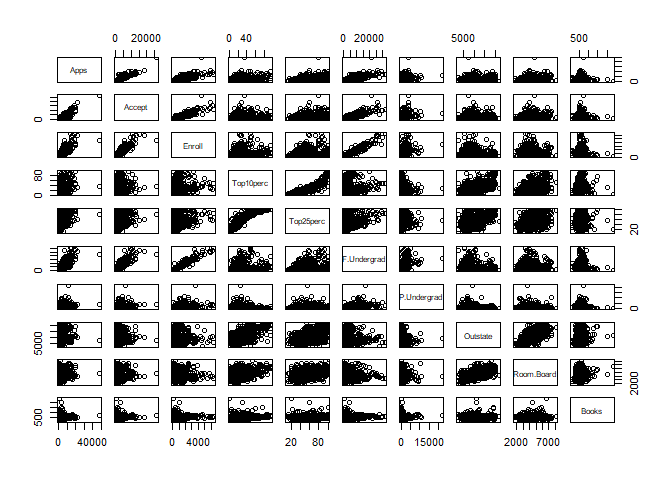
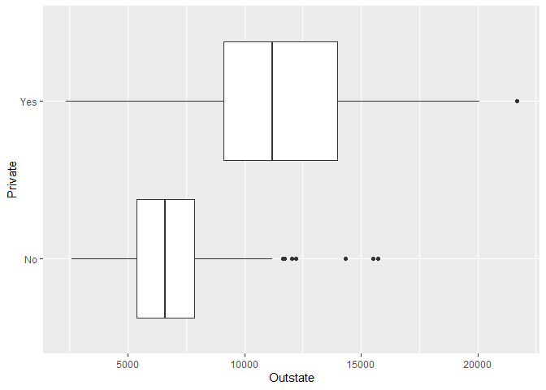
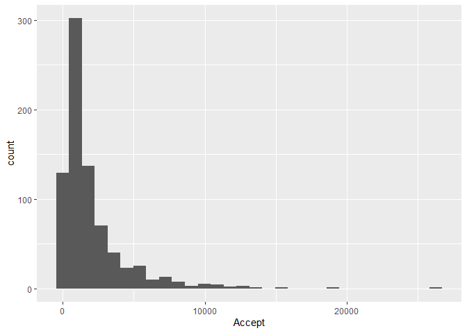
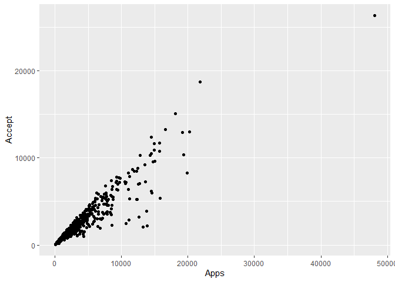

Chapter 2 exercises
================

    Warning: package 'readr' was built under R version 4.1.3

    Warning: package 'dplyr' was built under R version 4.1.3

    Warning: package 'ggplot2' was built under R version 4.1.3

## Applied exercises

### This exercise relates to the College data set, which can be found in the file College.csv

1)  Use the read.csv() function to read the data into R. Call the loaded
    data college. Make sure that you have the directory set to the
    correct location for the data.

``` r
college <-read_csv("../data/college.csv")
```

2)  Look at the data using the fix() function. You should notice that
    the first column is just the name of each university. We don’t
    really want R to treat this as data. However, it may be handy to
    have these names for later.

``` r
# I a personally not a fan of using rownames. I think it's better to keep this row as a character column.
college <- college %>% tibble::column_to_rownames("...1")
```

3)  

``` r
# i 
summary(college)
```

       Private               Apps           Accept          Enroll    
     Length:777         Min.   :   81   Min.   :   72   Min.   :  35  
     Class :character   1st Qu.:  776   1st Qu.:  604   1st Qu.: 242  
     Mode  :character   Median : 1558   Median : 1110   Median : 434  
                        Mean   : 3002   Mean   : 2019   Mean   : 780  
                        3rd Qu.: 3624   3rd Qu.: 2424   3rd Qu.: 902  
                        Max.   :48094   Max.   :26330   Max.   :6392  
       Top10perc       Top25perc      F.Undergrad     P.Undergrad     
     Min.   : 1.00   Min.   :  9.0   Min.   :  139   Min.   :    1.0  
     1st Qu.:15.00   1st Qu.: 41.0   1st Qu.:  992   1st Qu.:   95.0  
     Median :23.00   Median : 54.0   Median : 1707   Median :  353.0  
     Mean   :27.56   Mean   : 55.8   Mean   : 3700   Mean   :  855.3  
     3rd Qu.:35.00   3rd Qu.: 69.0   3rd Qu.: 4005   3rd Qu.:  967.0  
     Max.   :96.00   Max.   :100.0   Max.   :31643   Max.   :21836.0  
        Outstate       Room.Board       Books           Personal   
     Min.   : 2340   Min.   :1780   Min.   :  96.0   Min.   : 250  
     1st Qu.: 7320   1st Qu.:3597   1st Qu.: 470.0   1st Qu.: 850  
     Median : 9990   Median :4200   Median : 500.0   Median :1200  
     Mean   :10441   Mean   :4358   Mean   : 549.4   Mean   :1341  
     3rd Qu.:12925   3rd Qu.:5050   3rd Qu.: 600.0   3rd Qu.:1700  
     Max.   :21700   Max.   :8124   Max.   :2340.0   Max.   :6800  
          PhD            Terminal       S.F.Ratio      perc.alumni   
     Min.   :  8.00   Min.   : 24.0   Min.   : 2.50   Min.   : 0.00  
     1st Qu.: 62.00   1st Qu.: 71.0   1st Qu.:11.50   1st Qu.:13.00  
     Median : 75.00   Median : 82.0   Median :13.60   Median :21.00  
     Mean   : 72.66   Mean   : 79.7   Mean   :14.09   Mean   :22.74  
     3rd Qu.: 85.00   3rd Qu.: 92.0   3rd Qu.:16.50   3rd Qu.:31.00  
     Max.   :103.00   Max.   :100.0   Max.   :39.80   Max.   :64.00  
         Expend        Grad.Rate     
     Min.   : 3186   Min.   : 10.00  
     1st Qu.: 6751   1st Qu.: 53.00  
     Median : 8377   Median : 65.00  
     Mean   : 9660   Mean   : 65.46  
     3rd Qu.:10830   3rd Qu.: 78.00  
     Max.   :56233   Max.   :118.00  

``` r
# ii
pairs(college[,2:11])
```



``` r
# iii
college %>% 
  ggplot(aes(Outstate, Private)) +
  geom_boxplot()
```



``` r
# iv
college <- college %>% 
  mutate(Elite = if_else(Top10perc > 50, "Yes", "No"))

college %>% group_by(Elite) %>% 
  summarise(n = n())
```

    # A tibble: 2 x 2
      Elite     n
      <chr> <int>
    1 No      699
    2 Yes      78

``` r
# v
college %>% 
  ggplot(aes(Accept)) +
  geom_histogram()
```

    `stat_bin()` using `bins = 30`. Pick better value with `binwidth`.



``` r
# vi
college %>% 
  ggplot(aes(Apps, Accept)) + 
  geom_point()
```



``` r
# weird outlier
college[which(college$Accept == max(college$Accept)),]
```

                             Private  Apps Accept Enroll Top10perc Top25perc
    Rutgers at New Brunswick      No 48094  26330   4520        36        79
                             F.Undergrad P.Undergrad Outstate Room.Board Books
    Rutgers at New Brunswick       21401        3712     7410       4748   690
                             Personal PhD Terminal S.F.Ratio perc.alumni Expend
    Rutgers at New Brunswick     2009  90       95      19.5          19  10474
                             Grad.Rate Elite
    Rutgers at New Brunswick        77    No

### This exercise involves the Auto data set studied in the lab.

``` r
Auto <- read_csv("../data/Auto.csv")
```

Which of the predictors are quantitative, and which are qualitative?

``` r
numeric <- lapply(Auto, function(x) is.numeric(x))
numeric
```

    $mpg
    [1] TRUE

    $cylinders
    [1] TRUE

    $displacement
    [1] TRUE

    $horsepower
    [1] FALSE

    $weight
    [1] TRUE

    $acceleration
    [1] TRUE

    $year
    [1] TRUE

    $origin
    [1] TRUE

    $name
    [1] FALSE

2)  What is the range of each quantitative predictor? You can answer
    this using the range() function.

``` r
Auto_num <- Auto[which(numeric == TRUE)]
lapply(Auto_num, function(x) range(x))
```

    $mpg
    [1]  9.0 46.6

    $cylinders
    [1] 3 8

    $displacement
    [1]  68 455

    $weight
    [1] 1613 5140

    $acceleration
    [1]  8.0 24.8

    $year
    [1] 70 82

    $origin
    [1] 1 3

3)  What is the mean and standard deviation of each quantitative
    predictor?

``` r
lapply(Auto_num, function(x) {
  list(
    mean = mean(x),
    sd = sd(x)
  )
}
)
```

    $mpg
    $mpg$mean
    [1] 23.51587

    $mpg$sd
    [1] 7.825804


    $cylinders
    $cylinders$mean
    [1] 5.458438

    $cylinders$sd
    [1] 1.701577


    $displacement
    $displacement$mean
    [1] 193.5327

    $displacement$sd
    [1] 104.3796


    $weight
    $weight$mean
    [1] 2970.262

    $weight$sd
    [1] 847.9041


    $acceleration
    $acceleration$mean
    [1] 15.55567

    $acceleration$sd
    [1] 2.749995


    $year
    $year$mean
    [1] 75.99496

    $year$sd
    [1] 3.690005


    $origin
    $origin$mean
    [1] 1.574307

    $origin$sd
    [1] 0.8025495

4)  Now remove the 10th through 85th observations. What is the range,
    mean, and standard deviation of each predictor in the subset of the
    data that remains?

``` r
Auto_num %>% slice(-(10:85)) %>% 
  lapply(function(x) {
  list(
    mean = mean(x),
    sd = sd(x)
  )
}
)
```

    $mpg
    $mpg$mean
    [1] 24.43863

    $mpg$sd
    [1] 7.908184


    $cylinders
    $cylinders$mean
    [1] 5.370717

    $cylinders$sd
    [1] 1.653486


    $displacement
    $displacement$mean
    [1] 187.0498

    $displacement$sd
    [1] 99.63539


    $weight
    $weight$mean
    [1] 2933.963

    $weight$sd
    [1] 810.6429


    $acceleration
    $acceleration$mean
    [1] 15.72305

    $acceleration$sd
    [1] 2.680514


    $year
    $year$mean
    [1] 77.15265

    $year$sd
    [1] 3.11123


    $origin
    $origin$mean
    [1] 1.598131

    $origin$sd
    [1] 0.8161627

5)  Using the full data set, investigate the predictors graphically,
    using scatterplots or other tools of your choice. Create some plots
    highlighting the relationships among the predictors. Comment on your
    findings.

<!-- -->

6)  Suppose that we wish to predict gas mileage (mpg) on the basis of
    the other variables. Do your plots suggest that any of the other
    variables might be useful in predicting mpg? Justify your answer.
